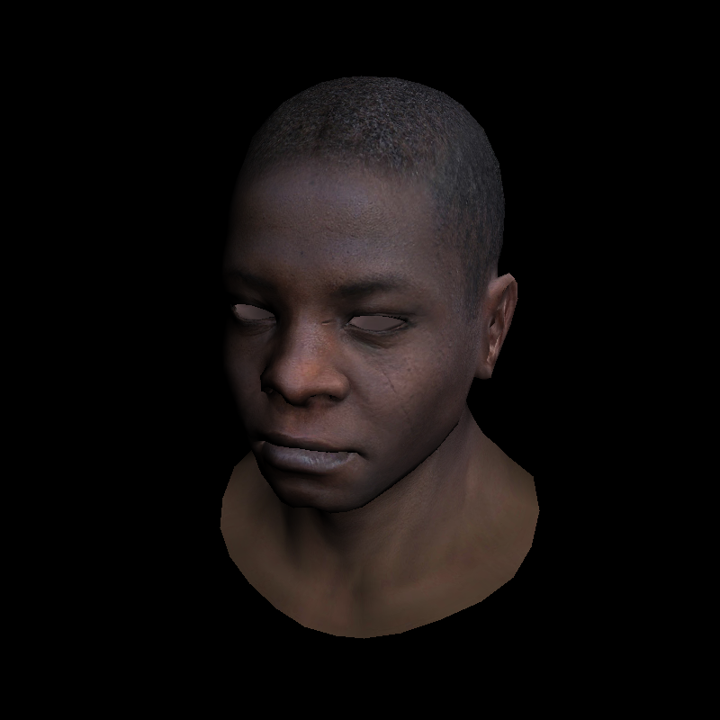

# TinyRenderer

This is a repository to implement a tiny renderer followed by the [tutorial](https://github.com/ssloy/tinyrenderer/wiki)

### Lesson 6: Shaders for the software renderer

[tutorial](<https://github.com/ssloy/tinyrenderer/wiki/Lesson-6:-Shaders-for-the-software-renderer)

branch: Lesson6

```
mkdir build && cd build && cmake ..
make && ./tinyrenderer && convert output.tga output.png && convert zbuffer.tga zbuffer.png
```

Output:
shaders with texture : diffuse & norm & spec

<center class="half">
    
    <space>
    
    <space>
    
</center>
zbuffer-gray 
<center class="half">
    
</center>
