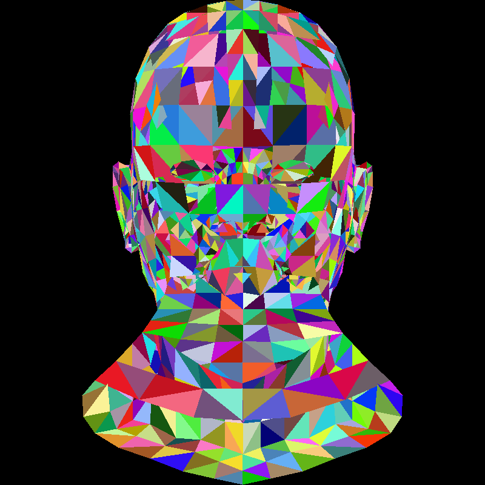
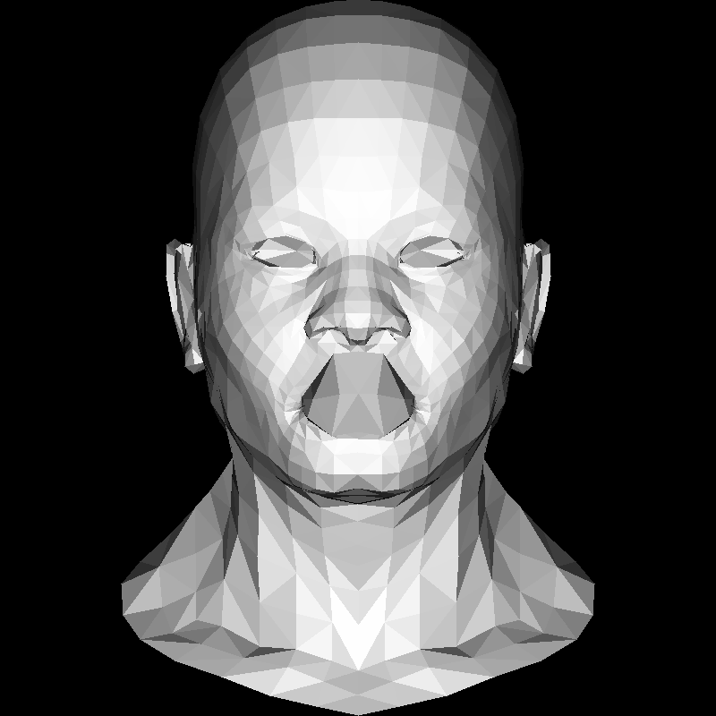

# TinyRenderer

This is a repository to implement a tiny renderer followed by the [tutorial](https://github.com/ssloy/tinyrenderer/wiki)

### Lesson2 Triangle rasterization and back face culling

[tutorial](https://github.com/ssloy/tinyrenderer/wiki/Lesson-2:-Triangle-rasterization-and-back-face-culling)

branch: Lesson2

```
mkdir build && cd build && cmake ..
make && ./tinyrenderer && convert output.tga output.png
```

Output:


