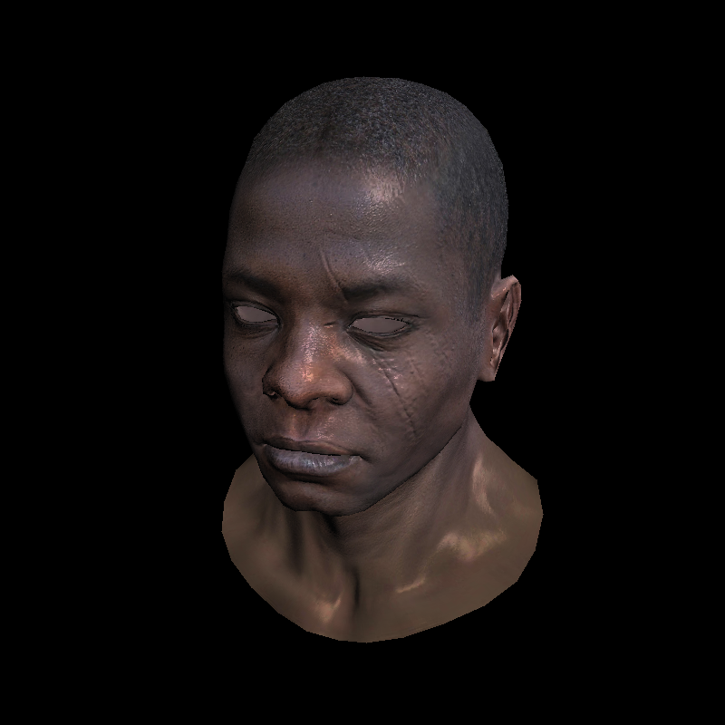

# TinyRenderer

This is a repository to implement a tiny renderer followed by the [tutorial](https://github.com/ssloy/tinyrenderer/wiki)

### Lesson 7: Shadow mapping

[tutorial](<https://github.com/ssloy/tinyrenderer/wiki/Lesson-7:-Shadow-mapping)

branch: Lesson7

```
mkdir build && cd build && cmake ..
make && ./tinyrenderer && convert framebuffer.tga framebuffer.png && convert depth.tga depth.png
```

Output:
shadow mapping : before & after

<center class="half">
    
    <space>
    
</center>
depth
<center class="half">
    
</center>
